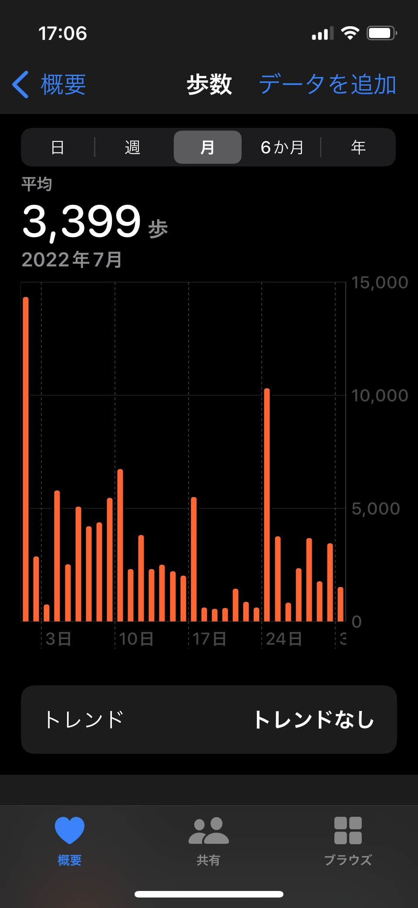

# iPhoneヘルスケアアプリ歩数読取ツール

### Introduction

iPhoneヘルスケアアプリ歩数読取ツール（以下、本ツール）は、iPhoneのヘルスケアアプリに表示される歩数の棒グラフを画像解析し、日々の歩数をExcelファイルとして書き出すツールです。

<div align='center'>

</div>

### Requirement
* Windows OS (64 bit) (Windows 10で動作確認済)
* Python 3.10 (3.10.7 で動作確認済)
  * https://www.python.org/downloads/
  * ※ インストール時は必ず「Add python.exe to PATH」にチェック
    * 初めての方は「1.Pythonのインストール」の手順を参照ください：https://prog-8.com/docs/python-env-win
  
* Tesseract (64 bit) (v5.2.0-alpha.20220721 で動作確認済)
  - （windows）OCRソフトインストーラを入手：https://github.com/UB-Mannheim/tesseract/wiki
    * その際の全体手順（「Tesseract OCRのテスト」まで）：https://fickle-it.net/2023/04/tesseract-ocr-install-windows/
  - （macOS）
    ```
    brew install tesseract tesseract-lang
    ```
    `getsteps_iOS16.py`に`pyocr.tesseract.TESSERACT_CMD`を変える
    ```python
    pyocr.tesseract.TESSERACT_CMD = r'/opt/homebrew/bin/tesseract'
    ```

* Visual Studio Code（vscode）
  * インストールから日本語表記変更までの手順：
https://miya-system-works.com/blog/detail/vscode-install/
  * ※他のエディタでも操作可能


### Usage

1. GitHubよりプログラムをダウンロード
   * ページ上部にある緑の「Code」を展開し、「Download ZIP」からダウンロード可能

2. vscodeでダウンロードしたフォルダを開く
    * vscodeで「healthcareapp_UT-main」フォルダを開く

3. Pythonパッケージ
   * vscode内のターミナルで下記のコマンドを実行し、必要なパッケージをインストール

    ```shell
    pip install -r requirements.txt
    ```

4. 画像データの準備
    * 'data' フォルダに解析したい歩数グラフ画像を格納
       * ※細かくフォルダに分けた状態で画像データを格納する場合は、config.iniファイルの 'Data_dir = data'の後ろにフォルダ名を追加する
          * 例）'Data_dir = data/xxx'

5. 実行
   * run.cmdをダブルクリックする
     * venvを使っている方はrun.cmdのactivateコメントを省く
   * 実行結果は 'output' フォルダに出力される


### Acknowledgements

旧ツール:
https://github.com/HMAdachi-THK/healthcareapp-stepsreader


#### Contributors

森まりも, Craig Katsube, 足立浩基, 天笠志保, 鎌田真光
(Marimo MORI, Craig Katsube, Hiroki ADACHI, Shiho AMAGASA, Masamitsu KAMADA) 
